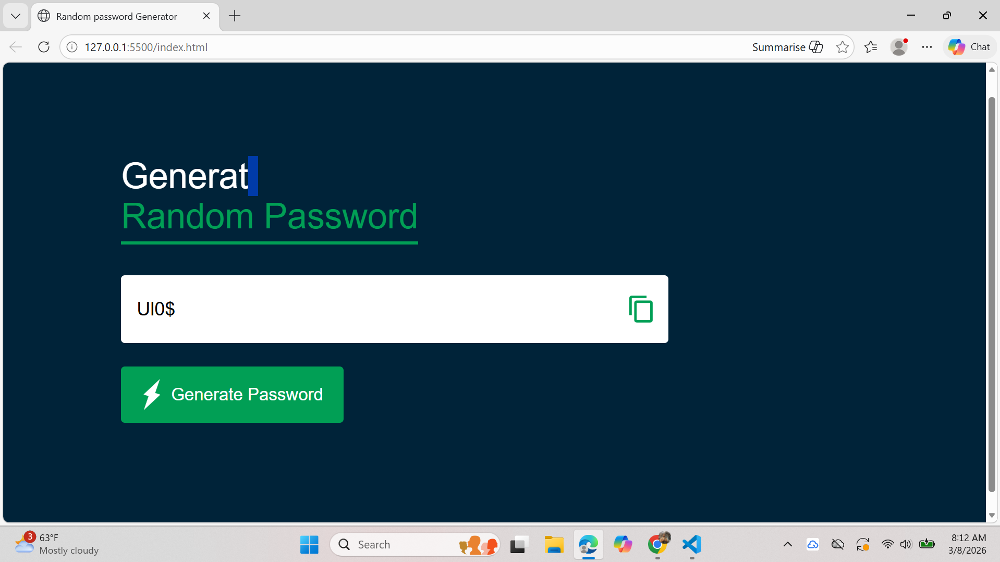

# 🔐 Password Generator

A simple and secure **Password Generator** built using **HTML, CSS, and JavaScript**.
This project generates strong random passwords containing uppercase letters, lowercase letters, numbers, and special symbols.

## 🚀 Features

* Generate strong random passwords
* Includes:

  * Uppercase letters
  * Lowercase letters
  * Numbers
  * Symbols
* Copy password to clipboard with one click
* Simple and clean UI
* Lightweight and beginner-friendly project

## 🛠️ Built With

* **HTML**
* **CSS**
* **JavaScript**

## 📸 How It Works

1. Click the **Generate Password** button.
2. A secure password will be generated instantly.
3. Click the **Copy** icon/button to copy the password to your clipboard.

## 🧠 Password Logic

The generator ensures password strength by including at least:

* 1 Uppercase letter
* 1 Lowercase letter
* 1 Number
* 1 Symbol

The remaining characters are randomly selected from all available characters to reach the desired password length.

## 📂 Project Structure

```
password-generator/
│
├── index.html
├── style.css
├── script.js
└── README.md
```


```

2. Open the project folder

```
cd password-generator
```

3. Run the project by opening **index.html** in your browser.

## 🎯 Future Improvements

* Add password length customization
* Add password strength indicator
* Add dark mode
* Convert to a React component
* Deploy live version

## 🤝 Contributing

Contributions, issues, and feature requests are welcome.

## ⭐ Show your support

If you like this project, give it a **star ⭐ on GitHub**.

## 👨‍💻 Author

Developed by **Fahad Karim**


