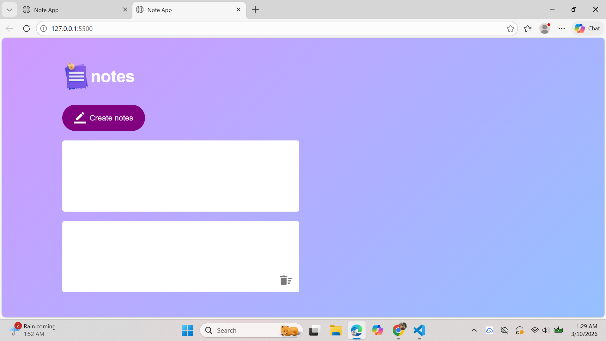

# 📝 JavaScript Notes App

A simple **Notes App built with HTML, CSS, and Vanilla JavaScript** that allows users to create, edit, and delete notes dynamically. The app also uses **LocalStorage** to save notes in the browser so they persist even after refreshing the page.

This project was built as part of learning **DOM Manipulation and JavaScript fundamentals through hands-on projects**.

---

## 🚀 Features

* ➕ Create new notes
* ✏️ Edit notes directly in the browser
* 🗑 Delete notes instantly
* 💾 Notes automatically saved using **LocalStorage**
* 🔄 Notes persist after page refresh
* ⚡ Dynamic DOM manipulation using JavaScript

---

## 🛠 Technologies Used

* **HTML5** – Structure of the application
* **CSS3** – Styling and layout
* **JavaScript (Vanilla JS)** – Functionality and logic
* **LocalStorage API** – Persistent browser storage

---

## 📂 Project Structure

```
notes-app/
│
├── index.html      # Main HTML structure
├── style.css       # Styling for the app
├── script.js       # JavaScript logic
└── images/         # Icons used in the project
```

---

## ⚙️ How It Works

### 1️⃣ Creating Notes

When the **Create Notes** button is clicked:

* JavaScript creates a new `<p>` element.
* The element is set as `contenteditable` so the user can type inside it.
* A delete icon (``) is added inside the note.
* The note is appended to the **notes container** in the DOM.

---

### 2️⃣ Deleting Notes

The app uses **Event Delegation**.

Instead of attaching a click event to every delete icon, a single event listener is added to the notes container.

When a user clicks the delete icon:

* JavaScript detects the clicked element (`e.target`)
* If the element is an image (`IMG`)
* The parent note is removed from the DOM

---

### 3️⃣ Saving Notes

Notes are saved using the **LocalStorage API**.

```
localStorage.setItem("notes", notesContainer.innerHTML)
```

This stores the entire HTML structure of the notes in the browser.

---

### 4️⃣ Loading Saved Notes

When the page loads, JavaScript retrieves saved notes:

```
notesContainer.innerHTML = localStorage.getItem("notes");
```

This restores previously created notes automatically.

---

## 🧠 Concepts Practiced

This project helped practice important JavaScript concepts:

* DOM Selection
* DOM Manipulation
* Event Listeners
* Event Delegation
* Dynamic Element Creation
* LocalStorage API
* JavaScript Functions

---

## 📸 Preview

Add a screenshot of the project here.

```

```

---

## 📈 Future Improvements

Possible improvements for the project:

* 📱 Responsive design
* 🗂 Note categories
* 🔍 Search notes
* 🌙 Dark mode
* ☁️ Cloud storage integration
* 🧾 Markdown support

---

## 👨‍💻 Author

**Fahad Karim**

* Aspiring **Full-Stack Developer**
* Interested in **AI, Web Development, and Open Source**


⭐ If you like this project, consider **starring the repository**!
