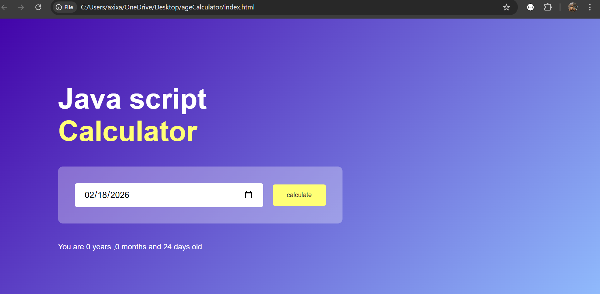

# 🎂 Age Calculator

A clean, beginner-friendly JavaScript project that calculates your exact age in **years, months, and days** based on your date of birth.

---


## 📸 Features

- 📅 Date picker with a **max date set to today** (no future dates allowed)
- 🧮 Calculates **exact age** in years, months, and days
- 🔁 Handles **month/day borrowing** (calendar arithmetic)
- ✅ Works correctly for **all edge cases** including leap years

---

## 🛠️ Built With

| Technology | Purpose |
|---|---|
| HTML | Page structure & date input |
| CSS | Styling & layout |
| JavaScript (Vanilla) | Age calculation logic |

---

## 📁 Project Structure

```
age-calculator/
│
├── index.html       # Main HTML file
├── style.css        # Styling
└── script.js        # Age calculation logic
```

---

## 🧠 How It Works

### 1. Restricting Future Dates
```javascript
userInput.max = new Date().toISOString().split("T")[0];
```
Gets today's date and sets it as the **maximum selectable date** in the input field.

### 2. Extracting Date Parts
```javascript
let d1 = birthDate.getDate();     // day
let m1 = birthDate.getMonth();    // month (0-indexed!)
let y1 = birthDate.getFullYear(); // year
```
> ⚠️ `getMonth()` returns 0 for January and 11 for December!

### 3. Calendar Arithmetic (Borrowing Logic)
Just like borrowing in school subtraction — if today's month is **before** the birth month, we borrow a year. If today's day is **before** the birth day, we borrow a month.

```javascript
// Borrow a year if needed
if (m2 < m1) {
    y3--;
    m3 = 12 + m2 - m1;
}

// Borrow a month if needed
if (d2 < d1) {
    m3--;
    d3 = getDaysInMonth(y1, m1) + d2 - d1;
}
```

### 4. Getting Days in a Month (Clever JS Trick!)
```javascript
function getDaysInMonth(year, month) {
    return new Date(year, month, 0).getDate();
}
```
`day = 0` means **"the last day of the previous month"** — a classic JS trick that automatically handles leap years!

---

## 🐛 Common Mistakes to Avoid

| Mistake | Fix |
|---|---|
| `getElementById('#date')` | Remove the `#` — it's only for CSS |
| Missing `id="result"` in HTML | JS needs this element to display output |
| Forgetting `addEventListener` | Wire your button or use `onclick` in HTML |
| Assuming `getMonth()` is 1-indexed | It starts from **0**, not 1 |

---

## ▶️ How to Run

1. Clone or download the project
2. Open `index.html` in any browser
3. Pick your birth date
4. Click **Calculate**
5. See your exact age! 🎉

---

## 📚 JS Concepts Practiced

- ✅ DOM manipulation (`getElementById`, `innerHTML`)
- ✅ Date objects (`new Date()`, `getDate()`, `getMonth()`, `getFullYear()`)
- ✅ String methods (`.toISOString()`, `.split()`)
- ✅ Array indexing (`[0]`)
- ✅ Conditional logic (`if/else`)
- ✅ Functions & helper functions
- ✅ Template literals (`` `You are ${y3} years old` ``)
- ✅ Edge case handling

---

## 👨‍💻 Author

Built as part of a **Vanilla JavaScript mini-projects** series focused on mastering JS logic through practical projects.

---

## 📄 License

This project is open source and free to use for learning purposes.
# 🎂 Age Calculator

A clean, beginner-friendly JavaScript project that calculates your exact age in **years, months, and days** based on your date of birth.

---

## 🚀 Live Demo

Enter your birth date → Click **Calculate** → See your exact age instantly!

---

## 📸 Features

- 📅 Date picker with a **max date set to today** (no future dates allowed)
- 🧮 Calculates **exact age** in years, months, and days
- 🔁 Handles **month/day borrowing** (calendar arithmetic)
- ✅ Works correctly for **all edge cases** including leap years

---

## 🛠️ Built With

| Technology | Purpose |
|---|---|
| HTML | Page structure & date input |
| CSS | Styling & layout |
| JavaScript (Vanilla) | Age calculation logic |

---

## 📁 Project Structure

```
age-calculator/
│
├── index.html       # Main HTML file
├── style.css        # Styling
└── script.js        # Age calculation logic
```

---

## 🧠 How It Works

### 1. Restricting Future Dates
```javascript
userInput.max = new Date().toISOString().split("T")[0];
```
Gets today's date and sets it as the **maximum selectable date** in the input field.

### 2. Extracting Date Parts
```javascript
let d1 = birthDate.getDate();     // day
let m1 = birthDate.getMonth();    // month (0-indexed!)
let y1 = birthDate.getFullYear(); // year
```
> ⚠️ `getMonth()` returns 0 for January and 11 for December!

### 3. Calendar Arithmetic (Borrowing Logic)
Just like borrowing in school subtraction — if today's month is **before** the birth month, we borrow a year. If today's day is **before** the birth day, we borrow a month.

```javascript
// Borrow a year if needed
if (m2 < m1) {
    y3--;
    m3 = 12 + m2 - m1;
}

// Borrow a month if needed
if (d2 < d1) {
    m3--;
    d3 = getDaysInMonth(y1, m1) + d2 - d1;
}
```

### 4. Getting Days in a Month (Clever JS Trick!)
```javascript
function getDaysInMonth(year, month) {
    return new Date(year, month, 0).getDate();
}
```
`day = 0` means **"the last day of the previous month"** — a classic JS trick that automatically handles leap years!

---

## 🐛 Common Mistakes to Avoid

| Mistake | Fix |
|---|---|
| `getElementById('#date')` | Remove the `#` — it's only for CSS |
| Missing `id="result"` in HTML | JS needs this element to display output |
| Forgetting `addEventListener` | Wire your button or use `onclick` in HTML |
| Assuming `getMonth()` is 1-indexed | It starts from **0**, not 1 |

---

## ▶️ How to Run

1. Clone or download the project
2. Open `index.html` in any browser
3. Pick your birth date
4. Click **Calculate**
5. See your exact age! 🎉

---

## 📚 JS Concepts Practiced

- ✅ DOM manipulation (`getElementById`, `innerHTML`)
- ✅ Date objects (`new Date()`, `getDate()`, `getMonth()`, `getFullYear()`)
- ✅ String methods (`.toISOString()`, `.split()`)
- ✅ Array indexing (`[0]`)
- ✅ Conditional logic (`if/else`)
- ✅ Functions & helper functions
- ✅ Template literals (`` `You are ${y3} years old` ``)
- ✅ Edge case handling

---

## 👨‍💻 Author

Built as part of a **Vanilla JavaScript mini-projects** series focused on mastering JS logic through practical projects.

---

## 📄 License

This project is open source and free to use for learning purposes.


# 🎂 Age Calculator

A clean, beginner-friendly JavaScript project that calculates your exact age in **years, months, and days** based on your date of birth.

---

## 🚀 Live Demo

Enter your birth date → Click **Calculate** → See your exact age instantly!

---

## 📸 Features

- 📅 Date picker with a **max date set to today** (no future dates allowed)
- 🧮 Calculates **exact age** in years, months, and days
- 🔁 Handles **month/day borrowing** (calendar arithmetic)
- ✅ Works correctly for **all edge cases** including leap years

---

## 🛠️ Built With

| Technology | Purpose |
|---|---|
| HTML | Page structure & date input |
| CSS | Styling & layout |
| JavaScript (Vanilla) | Age calculation logic |

---

## 📁 Project Structure

```
age-calculator/
│
├── index.html       # Main HTML file
├── style.css        # Styling
└── script.js        # Age calculation logic
```

---

## 🧠 How It Works

### 1. Restricting Future Dates
```javascript
userInput.max = new Date().toISOString().split("T")[0];
```
Gets today's date and sets it as the **maximum selectable date** in the input field.

### 2. Extracting Date Parts
```javascript
let d1 = birthDate.getDate();     // day
let m1 = birthDate.getMonth();    // month (0-indexed!)
let y1 = birthDate.getFullYear(); // year
```
> ⚠️ `getMonth()` returns 0 for January and 11 for December!

### 3. Calendar Arithmetic (Borrowing Logic)
Just like borrowing in school subtraction — if today's month is **before** the birth month, we borrow a year. If today's day is **before** the birth day, we borrow a month.

```javascript
// Borrow a year if needed
if (m2 < m1) {
    y3--;
    m3 = 12 + m2 - m1;
}

// Borrow a month if needed
if (d2 < d1) {
    m3--;
    d3 = getDaysInMonth(y1, m1) + d2 - d1;
}
```

### 4. Getting Days in a Month (Clever JS Trick!)
```javascript
function getDaysInMonth(year, month) {
    return new Date(year, month, 0).getDate();
}
```
`day = 0` means **"the last day of the previous month"** — a classic JS trick that automatically handles leap years!

---

## 🐛 Common Mistakes to Avoid

| Mistake | Fix |
|---|---|
| `getElementById('#date')` | Remove the `#` — it's only for CSS |
| Missing `id="result"` in HTML | JS needs this element to display output |
| Forgetting `addEventListener` | Wire your button or use `onclick` in HTML |
| Assuming `getMonth()` is 1-indexed | It starts from **0**, not 1 |

---

## ▶️ How to Run

1. Clone or download the project
2. Open `index.html` in any browser
3. Pick your birth date
4. Click **Calculate**
5. See your exact age! 🎉

---

## 📚 JS Concepts Practiced

- ✅ DOM manipulation (`getElementById`, `innerHTML`)
- ✅ Date objects (`new Date()`, `getDate()`, `getMonth()`, `getFullYear()`)
- ✅ String methods (`.toISOString()`, `.split()`)
- ✅ Array indexing (`[0]`)
- ✅ Conditional logic (`if/else`)
- ✅ Functions & helper functions
- ✅ Template literals (`` `You are ${y3} years old` ``)
- ✅ Edge case handling

---

## 👨‍💻 Author

Built as part of a **Vanilla JavaScript mini-projects** series focused on mastering JS logic through practical projects.

---

## 📄 License

This project is open source and free to use for learning purposes.
