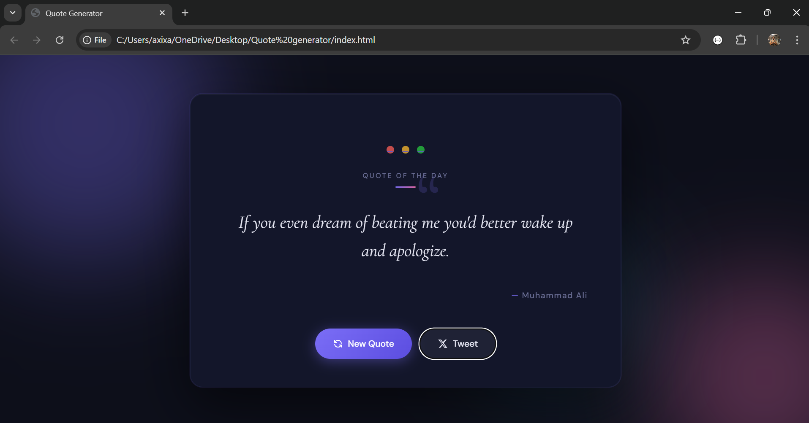

# ✦ Random Quote Generator

A sleek, dark-themed quote generator built with vanilla HTML, CSS, and JavaScript. Fetches random quotes from a live API and lets you share them directly to X (Twitter) — all in a polished, industry-grade UI.


---

## 🖥️ Preview

> Dark luxury editorial design with animated ambient orbs, elegant serif typography, and smooth micro-interactions.

---

## ✨ Features

- 🔀 **Random quotes** fetched live from the [DummyJSON Quotes API](https://dummyjson.com/quotes)
- 🐦 **Tweet button** — share any quote directly to X (Twitter)
- 🎨 **Industry-grade UI** — dark theme, glassmorphism card, animated background orbs
- 📱 **Fully responsive** — works on desktop, tablet, and mobile
- ⚡ **Zero dependencies** — pure HTML, CSS, and JavaScript

---

## 🚀 Getting Started


### 2. Open in browser

No build tools or installs needed. Just open `index.html` directly:

```bash
open index.html
```

Or use a local development server like [Live Server](https://marketplace.visualstudio.com/items?itemName=ritwickdey.LiveServer) in VS Code.

---

## 📁 Project Structure

```
quote-generator/
├── index.html      # Markup and layout
├── style.css       # All styling and animations
├── script.js       # API fetch logic and tweet functionality
└── README.md       # You're here
```

---

## 🔌 API

This project uses the **[DummyJSON Quotes API](https://dummyjson.com/quotes)** — free, reliable, and requires no API key.

**Endpoint used:**
```
GET https://dummyjson.com/quotes/random
```

**Sample response:**
```json
{
  "id": 24,
  "quote": "The only way to do great work is to love what you do.",
  "author": "Steve Jobs"
}
```

---

## 🛠️ How It Works

1. On page load, `getQuote()` is called automatically, fetching a random quote from the API
2. The quote text and author name are injected into the DOM
3. Clicking **New Quote** fires `getQuote()` again for a fresh quote
4. Clicking **Tweet** opens X (Twitter) with the current quote pre-filled

---

## 🎨 Design Highlights

| Detail | Choice |
|---|---|
| Color scheme | Dark navy (`#0d0f1a`) with purple & pink accents |
| Display font | Cormorant Garamond (italic serif) |
| UI font | DM Sans |
| Background effect | Animated radial gradient orbs |
| Card style | Dark glassmorphism with glow border |
| Buttons | Gradient primary + ghost secondary |

---

## 📄 License

This project is open source and available under the [MIT License](LICENSE).

---

## 🙌 Acknowledgements

- [DummyJSON](https://dummyjson.com/) for the free quotes API
- [Google Fonts](https://fonts.google.com/) for Cormorant Garamond & DM Sans
- [Shields.io](https://shields.io/) for the README badges

