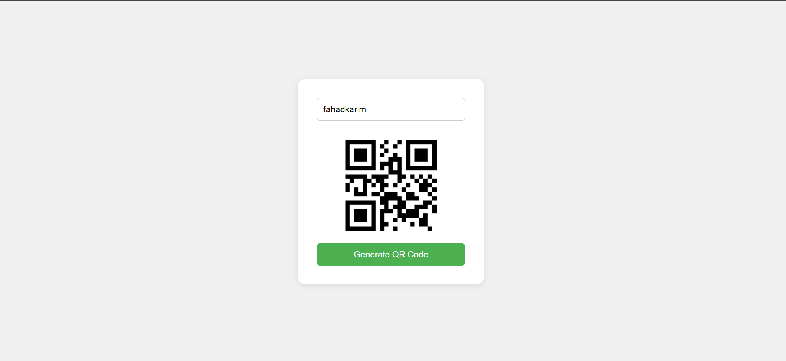

A simple, lightweight web app that generates QR codes from any text or URL instantly — no backend required.

🚀 Demo
Enter any text or URL, click Generate QR Code, and your QR code appears instantly.

📁 Project Structure
qr-code-generator/
├── index.html      # Main HTML structure
├── style.css       # Styling and layout
└── script.js       # QR code generation logic

⚙️ How It Works
The app uses the free QR Server API to generate QR codes on the fly — no libraries or packages needed.
https://api.qrserver.com/v1/create-qr-code/?size=150x150&data=YOUR_TEXT

🛠️ Getting Started
No installation or build tools required. Just open the file in your browser.
1. Clone the repository
bashgit clone https://github.com/your-username/qr-code-generator.git
2. Open in browser
bashcd qr-code-generator
open index.html
Or simply double-click index.html to open it in your default browser.

📖 Usage

Type any text or paste a URL into the input field
Click the Generate QR Code button
Your QR code will appear below the input
Scan it with any phone camera or QR scanner app

✨ Features

Generates QR codes for any text or URL
Clean and minimal UI
Input validation with user-friendly alerts
Handles special characters safely with encodeURIComponent
No dependencies or npm packages required
Works entirely in the browser

🌐 API Used
QR Code Generator API by goqr.me

Free to use
No API key required
Supports custom sizes

🧰 Technologies Used
TechnologyPurposeHTML5Page structureCSS3Styling and layoutJavaScript (Vanilla)Logic and API callQR Server APIQR code generation

📝 License
This project is open source and available under the MIT License.

🙌 Acknowledgements

QR code generation powered by goqr.me

Readme · MDCopyQR Code Generator
A simple, lightweight web app that generates QR codes from any text or URL instantly — no backend required.

🚀 Demo
Enter any text or URL, click Generate QR Code, and your QR code appears instantly.

📁 Project Structure
qr-code-generator/
├── index.html      # Main HTML structure
├── style.css       # Styling and layout
└── script.js       # QR code generation logic

⚙️ How It Works
The app uses the free QR Server API to generate QR codes on the fly — no libraries or packages needed.
https://api.qrserver.com/v1/create-qr-code/?size=150x150&data=YOUR_TEXT

🛠️ Getting Started
No installation or build tools required. Just open the file in your browser.
1. Clone the repository
bashgit clone https://github.com/your-username/qr-code-generator.git
2. Open in browser
bashcd qr-code-generator
open index.html
Or simply double-click index.html to open it in your default browser.

📖 Usage

Type any text or paste a URL into the input field
Click the Generate QR Code button
Your QR code will appear below the input
Scan it with any phone camera or QR scanner app

✨ Features

Generates QR codes for any text or URL
Clean and minimal UI
Input validation with user-friendly alerts
Handles special characters safely with encodeURIComponent
No dependencies or npm packages required
Works entirely in the browser

🌐 API Used
QR Code Generator API by goqr.me

Free to use
No API key required
Supports custom sizes

🧰 Technologies Used
TechnologyPurposeHTML5Page structureCSS3Styling and layoutJavaScript (Vanilla)Logic and API callQR Server APIQR code generation

📝 License
This project is open source and available under the MIT License.

🙌 Acknowledgements

QR code generation powered by goqr.me

