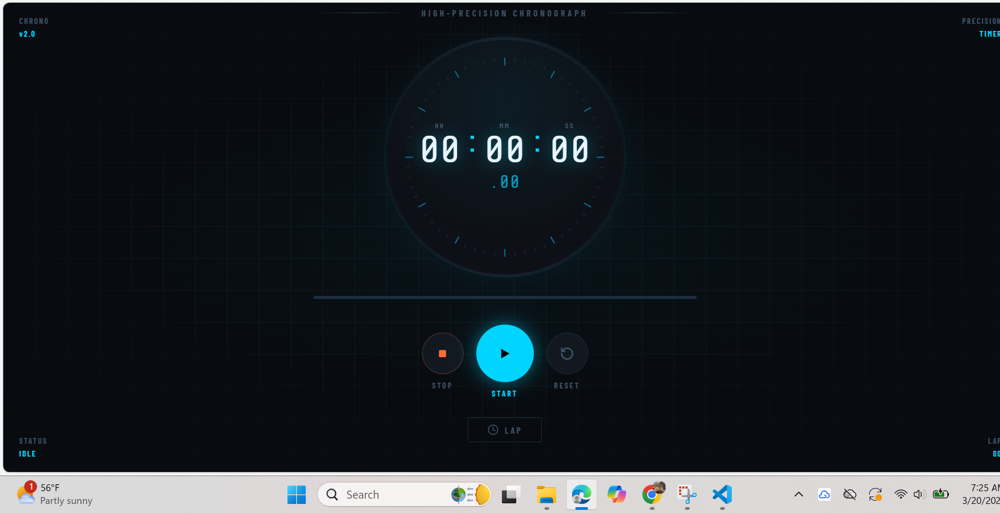

# ⏱ CHRONO — Precision Stopwatch

> A high-precision, cockpit-style stopwatch built with vanilla HTML, CSS, and JavaScript. No frameworks. No dependencies. Just craft.

    

---

## 📸 Preview


```
┌──────────────────────────────────┐
│  CHRONO                  v2.0    │
│                                  │
│        ┌─────────────┐           │
│        │  00:00:00   │           │
│        │    .00      │           │
│        └─────────────┘           │
│     [STOP]  [▶ START]  [RESET]   │
│              [ LAP ]             │
└──────────────────────────────────┘
```

---

## ✨ Features

- **HH:MM:SS display** with live millisecond counter
- **Circular SVG ring** with 60 precision tick marks
- **60-second progress bar** that cycles with each minute
- **Lap tracking** — records split and total time per lap
- **Best/worst lap highlighting** — fastest in green, slowest in orange
- **Live HUD status** — IDLE → RUNNING → PAUSED
- **Dark industrial UI** — cockpit-inspired aesthetic with animated background grid
- **Fully responsive** — works on desktop and mobile
- **Zero dependencies** — pure HTML, CSS, and JavaScript

---

## 🗂 Project Structure

```
chrono-stopwatch/
│
├── index.html       # Markup & layout
├── style.css        # All styling (CSS variables, animations, responsive)
├── script.js        # Stopwatch logic + UI enhancements
└── README.md
```

---

d

## 🎮 Usage

| Button | Action |
|--------|--------|
| ▶ START | Begin or resume the timer |
| ⏹ STOP | Pause the timer |
| ↺ RESET | Reset everything to 00:00:00 |
| LAP | Record current split (only works while running) |

**Lap table columns:**
- `LAP` — lap number
- `SPLIT` — time since last lap
- `TOTAL` — elapsed time at the moment of the lap

---

## 🧠 How It Works

The core timer logic is intentionally simple — a single `setInterval` that increments seconds and cascades into minutes and hours:

```javascript
function stopwatch() {
    second++;
    if (second == 60) {
        second = 0;
        minute++;
        if (minute == 60) {
            minute = 0;
            hour++;
        }
    }
    
}
```

Everything else — milliseconds, lap tracking, progress bar, animations — is layered on top without modifying this core function.

---

## 🎨 Design Decisions

| Choice | Reasoning |
|--------|-----------|
| `Share Tech Mono` | Monospaced digits prevent layout shift on updates |
| `Barlow Condensed` | Compact, high-contrast labels for HUD elements |
| CSS custom properties | Single source of truth for the entire color palette |
| SVG tick ring | Drawn programmatically — no image assets required |
| `setInterval` at 1000ms | Matches the original logic; ms counter runs separately at 30ms |

---

## 🐛 Bugs Fixed (v1 → v2)

The original version had 6 bugs that were identified and corrected:

| # | Bug | Fix |
|---|-----|-----|
| 1 | `oncanplay` used instead of `onclick` | Changed to `onclick` |
| 2 | `timer` variable used but never declared | Added `let timer = null` |
| 3 | CSS targeting `.stopwatch` (class) but HTML used `id="stopwatch"` | Fixed selector to `#stopwatch` |
| 4 | No `watchStop()` function defined | Added stop function |
| 5 | No `watchReset()` function defined | Added reset function |
| 6 | Digits displayed as `1:2:3` instead of `01:02:03` | Added `padStart(2, '0')` |

---

## 📱 Browser Support

| Browser | Supported |
|---------|-----------|
| Chrome 90+ | ✅ |
| Firefox 88+ | ✅ |
| Safari 14+ | ✅ |
| Edge 90+ | ✅ |
| Mobile (iOS/Android) | ✅ |

---

## 📄 License

MIT — free to use, modify, and distribute. See [`LICENSE`](LICENSE) for details.

---

## 🙋 Author

Built by fahadkarim —
If you found this useful, a ⭐ on the repo goes a long way!